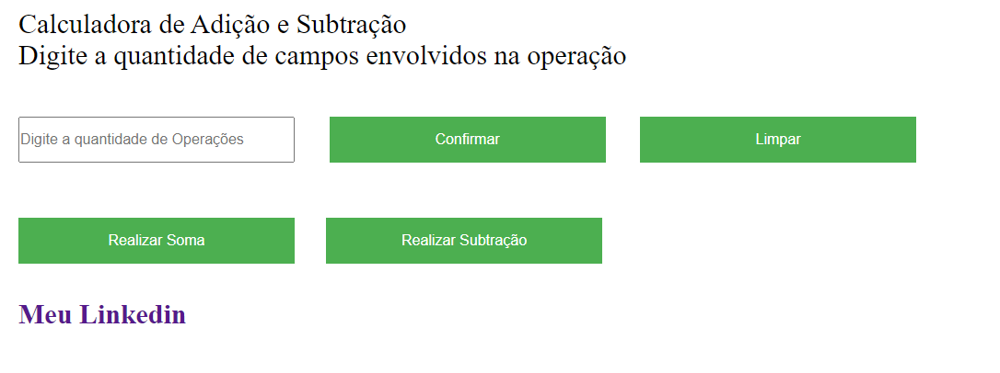

<h1 align="center">
	Calculadora Soma e Subtração
</h1>

# About the project
O projeto consiste na criação de uma calculadora básica com apenas soma e subtração.

# Technologies
-HTML
-CSS
-Jquery
#
<h1 align="center">
	
		
*Clone the project and access the folder*

```bash
git clone https://github.com/cbmateus-dev/calculadorajqueryteste
```

&&
```
bash
cd calculadorajquery
```


